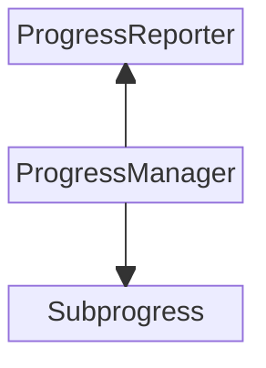

# `ProgressManager`: Progress Reporting in Swift Concurrency  

* Proposal: SF-0023
* Author(s): [Chloe Yeo](https://github.com/chloe-yeo)
* Review Manager: [Charles Hu](https://github.com/iCharlesHu)
* Status: **Accepted**
* Review:
  * [Pitch](https://forums.swift.org/t/pitch-progress-reporting-in-swift-concurrency/78112/10)
  * [First Review](https://forums.swift.org/t/review-sf-0023-progress-reporting-in-swift-concurrency/79474)
  * [Second Pitch](https://forums.swift.org/t/pitch-2-progressmanager-progress-reporting-in-swift-concurrency/80024)
  * [Second Review](https://forums.swift.org/t/review-2nd-sf-0023-progressreporter-progress-reporting-in-swift-concurrency/80284)

## Revision history

* **v1** Initial version
* **v2** Major Updates: 
    - Replaced generics with `@dynamicMemberLookup` to account for additional metadata
    - Replaced localized description methods with `ProgressReporter.FormatStyle` and `ProgressReporter.FileFormatStyle`
    - Replaced top level `totalCount` to be get-only and only settable via `withProperties` closure
    - Added the ability for `completedCount` to be settable via `withProperties` closure
    - Omitted checking of `Task.cancellation` in `complete(count:)` method
* **v3** Minor Updates: 
    - Renamed `ProgressReporter.Progress` struct to `Subprogress` 
    - Renamed `assign(count:)` method to `subprogress(assigningCount:)` 
    - Restructure examples in `Proposed Solution` to showcase clearer difference of progress-reporting framework code and progress-observing developer code  
* **v4** Major Updates: 
    - Renamed `ProgressReporter` class to `ProgressManager` 
    - Introduced `ProgressReporter` type and `assign(count:to:)` for alternative use cases, including multi-parent support
    - Specified Behavior of `ProgressManager` for `Task` cancellation
    - Redesigned implementation of custom properties to support both holding values of custom property of `self` and of descendants, and multi-parent support
    - Introduced `values(of:)` and `total(of:)` methods to dislay and aggregate values of custom properties in a subtree
    - Restructured examples in Proposed Solution to show the use of `Subprogress` and `ProgressReporter` in different cases and enforce use of `subprogress` as parameter label for methods reporting progress and use of `progressReporter` as property name when returning `ProgressReporter` from a library
    - Expanded Future Directions
    - Expanded Alternatives Considered
    - Moving `FormatStyle` to separate future proposal
* **v5** Minor Updates: 
    - Renamed `manager(totalCount:)` method to `start(totalCount)`
    - Changed the return type of `values(of:)` to be an array of non-optional values
    - Clarified cycle-detection behavior in `assign(count:to:)` at runtime
    - Added `CustomStringConvertible` and `CustomDebugStringConvertible` conformance to `ProgressManager` and `ProgressReporter`
    - Expanded Future Directions
    - Expanded Alternatives Considered
    
## Table of Contents 

* [Introduction](#introduction)
* [Motivation](#motivation)
* [Proposed Solution and Example](#proposed-solution-and-example)
* [Detailed Design](#detailed-design)
* [Impact on Existing Code](#impact-on-existing-code)
* [Future Directions](#future-directions)
* [Alternatives Considered](#alternatives-considered)
* [Acknowledgements](#acknowledgements)

## Introduction

Progress reporting is a generally useful concept, and can be helpful in all kinds of applications: from high level UIs, to simple command line tools, and more.

Foundation offers a progress reporting mechanism that has been popular with application developers on Apple platforms. The existing `Progress` class provides a self-contained, tree-based mechanism for progress reporting and is adopted in various APIs to report progress. While the recommended usage pattern of `Progress` works well with Cocoa's completion-handler-based async APIs, it does not fit well with Swift's concurrency support via async/await. 

This proposal aims to introduce a new Progress Reporting API —— `ProgressManager` —— to Foundation. This API is designed with several key objectives in mind:  

1. **Swift Concurrency Integration**: This API enables smooth, incremental progress reporting within async/await code patterns.

2. **Self-Documenting Design**: The types introduced in this API clearly separate the composition of progress from observation of progress and allow developers to make it obvious which methods report progress to clients. 

3. **Error-Resistant Architecture**: One common mistake/footgun when it comes to progress reporting is reusing the [same progress reporting instance](#advantages-of-using-subprogress-as-currency-type). This tends to lead to mistakenly overwriting its expected unit of work after previous caller has set it, or "over completing" / "double finishing" the report after it's been completed. This API prevents this by introducing strong types with different roles. Additionally, it handles progress delegation, accumulation, and nested reporting automatically, eliminating race conditions and progress calculation errors.

4. **Decoupled Progress and Task Control**: This API focuses exclusively on progress reporting, clearly separating it from task control mechanisms like cancellation, which remain the responsibility of Swift's native concurrency primitives for a more coherent programming model. While this API does not assume any control over tasks, it needs to be consistently handling non-completion of progress so it will react to cancellation by completing the progress upon `deinit`. 

5. **Swift Observation Framework Support**: This API leverages the `@Observable` macro to make progress information automatically bindable to UI components, enabling reactive updates with minimal boilerplate code. The Observation framework also provides a way for developers to observe values of `@Observable` APIs via `AsyncSequence`.  

6. **Type-Safe Extensibility**: This API provides a structured way to attach and propagate custom metadata alongside the standard numerical progress metrics through a type-safe property system.

7. **Dual Use Case Support**: This API provides a model that supports both function-level progress reporting and class-level progress reporting. In the latter case, the progress type exposed can be part of more than one progress tree. 

## Motivation

### Reporting Progress using Existing `Progress` API 

The existing `Progress` API can be used two different ways. A method can return a `Progress`, or a class can conform to the `ProgressReporting` protocol and contain a `Progress` property.

#### Return a `Progress` Instance from a Method 

The current recommended usage pattern of the existing `Progress`, as outlined in [Apple Developer Documentation](https://developer.apple.com/documentation/foundation/progress), does not fit well with async/await style concurrency. Typically, a function that aims to report progress to its callers will first return an instance of the existing `Progress`. The returned instance is then added as a child to a parent `Progress` instance. The only way to use the existing `Progress` API in a way that is compatible with Swift's async/await style concurrency would be to pass a `Progress` instance as a parameter to functions or methods that report progress.

In the following example, we have a function `chopFruits(completionHandler:)` reports progress to its caller, `makeSalad()`. 

```swift
public func makeSalad() {
    let progress = Progress(totalUnitCount: 3) // parent Progress instance 
    let chopSubprogress = chopFruits { result in // child Progress instance 
        switch result {
            case .success(let progress): 
                progress.completedUnitCount += 1
            case .failure(let error): 
                print("Fruits not chopped")
        }
    } 
    progress.addChild(chopSubprogress, withPendingUnitCount: 1) 
}

public func chopFruits(completionHandler: @escaping (Result<Progress, Error>) -> Void) -> Progress {}
```

When we update this function to use async/await, the previous pattern no longer composes as expected: 

```swift
public func makeSalad() async {
    let progress = Progress(totalUnitCount: 3) 
    let chopSubprogress = await chopFruits() 
    progress.addChild(chopSubprogress, withPendingUnitCount: 1) 
}

public func chopFruits() async -> Progress {}
```

We are forced to await the `chopFruits()` call before returning the `Progress` instance. However, the `Progress` instance that is returned from `chopFruits` already has its `completedUnitCount` equal to `totalUnitCount`. Since the `chopSubprogress` would have been completed before being added as a child to its parent `Progress`, it fails to show incremental progress as the code runs to completion within the method.

While it may be possible to use the existing `Progress` to report progress in an `async` function to show incremental progress, by passing `Progress` as an argument to the function reporting progress, it is more error-prone, as shown below: 

```swift
let fruits = [Ingredient("apple"), Ingredient("orange"), Ingredient("melon")]
let vegetables = [Ingredient("spinach"), Ingredient("carrots"), Ingredient("celeries")]

public func makeSalad() async {
    let progress = Progress(totalUnitCount: 2)
    
    let chopSubprogress = Progress()
    progress.addChild(chopSubprogress, withPendingUnitCount: 1)
    
    await chopFruits(progress: chopSubprogress)
    
    await chopVegetables(progress: chopSubprogress) // Author's mistake: same subprogress was reused! 
}

public func chopFruits(progress: Progress) async {
    progress.totalUnitCount = Int64(fruits.count)
    for fruit in fruits {
        await fruit.chop()
        progress.completedUnitCount += 1
    }
}

public func chopVegetables(progress: Progress) async {
    progress.totalUnitCount = Int64(vegetables.count) // Author's mistake: overwriting progress made in `chopFruits` on the same `progress` instance!
    for vegetable in vegetables {
        await vegetable.chop()
        progress.completedUnitCount += 1
    }
}
```

The existing `Progress` was not designed in a way that enforces the usage of `Progress` instance as a function parameter to report progress. Without a strong rule about who creates the `Progress` and who consumes it, it is easy to end up in a situation where the `Progress` is used more than once. This results in nondeterministic behavior when developers may accidentally overcomplete or overwrite a `Progress` instance.

#### Return a `Progress` Instance from a Class Conforming to `Foundation.ProgressReporting` Protocol 

Another recommended usage pattern of `Progress`, which involves the `ProgressReporting` protocol, is outlined in [Apple Developer Documentation](https://developer.apple.com/documentation/foundation/progressreporting). While this approach does not suffer from the same problem of `Progress` completing before being added to be part of a `Progress` tree, it exposes all of the mutable state of `Progress` to its observers.

### `ProgressManager` API 

We propose introducing a new progress reporting type called `ProgressManager`. `ProgressManager` is used to manage the composition of progress by either assigning it, or completing it. 

In order to compose progress into trees, we also introduce two more types:

1. `Subprogress`: A `~Copyable` type, used when a `ProgressManager` wishes to assign a portion of its total progress to an `async` function.
2. `ProgressReporter`: A class used to report progress of `ProgressManager` to interested observers. This includes one or more other `ProgressManager`s, which may incorporate those updates into their own progress.



## Proposed solution and example

### Reporting Progress using `Subprogress` 

To begin, let's assume there is a library `FoodProcessor` and a library `Juicer`. Both libraries report progress. 

```swift
// FoodProcessor.framework
public class FoodProcessor {
    
    func process(ingredients: [Ingredient], subprogress: consuming Subprogress? = nil) async {
          let manager = subprogress?.start(totalCount: ingredients.count + 1)
          
          // Do some work in a function
          await chop(manager?.subprogress(assigningCount: ingredients.count))
          
          // Call some other function that does not yet support progress reporting, and complete the work myself
          await blender.blend(ingredients)
          manager?.complete(count: 1)
    }
    
    static func chop(_ ingredient: Ingredient) -> Ingredient { ... }
}

// Juicer.framework
public class Juicer {
    
    public func makeJuice(ingredients: [Ingredient], subprogress: consuming Subprogress? = nil) async {
        let manager = subprogress?.start(totalCount: ingredients.count)
        
        for ingredient in ingredients {
            await ingredient.blend()
            manager?.complete(count: 1)
        }
    }
}
```

When we prepare dinner, we may want to use both the `FoodProcessor` and `Juicer` asynchronously. We can do so as follows: 

```swift 
// Developer Code 
let overallManager = ProgressManager(totalCount: 2)
let foodProcessor = FoodProcessor()
let juicer = Juicer()
let mainCourse = [Ingredient("Spinach"), Ingredient("Cabbage"), Ingredient("Carrot")]
let beverage = [Ingredient("Celery"), Ingredient("Kale"), Ingredient("Apple")]

await withTaskGroup(of: Void.self) { group in
    group.addTask {
        // Instantiate `Subprogress` to pass as a parameter
        await foodProcessor.process(ingredients: mainCourse, subprogress: overallManager.subprogress(assigningCount: 1))
    }
    
    group.addTask {
        await juicer.makeJuice(ingredients: beverage, subprogress: overallManager.subprogress(assigningCount: 1))
    }
}
```

<details>

<summary>

### Advantages of using `Subprogress` as Currency Type

</summary>

There are two main advantages to using `Subprogress` as a currency type for assigning progress:

1. It is `~Copyable` to ensure that the progress is assigned to only one task. Additionally, due to its `~Copyable` nature, the API can detect whether or not the `Subprogress` is consumed. If the `Subprogress` is not converted into a `ProgressManager` (for example, due to an error or early return), then the assigned count is marked as completed in the parent `ProgressManager`.
2. When used as an argument to a function, it is clear that the function supports reporting progress.

Here's how you use the proposed API to get the most of its benefits:

1. Pass `Subprogress` as a parameter to functions that report progress.

Inside the function, create a child `ProgressManager` instance to report progress in its own world via `start(totalCount:)`, as follows: 

```swift
func correctlyUsingSubprogress() async {
    let overall = ProgressManager(totalCount: 2)
    await subTask(subprogress: overall.subprogress(assigningCount: 1))
}

func subTask(subprogress: consuming Subprogress? = nil) async {
    let count = 10
    let manager = subprogress?.start(totalCount: count) // returns an instance of ProgressManager that can be used to report progress of subtask
    for _ in 1...count {
        manager?.complete(count: 1) // reports progress as usual
    }
}
```

If developers accidentally try to report progress to a passed-in `Subprogress`, the compiler can inform developers, as the following. The fix is quite straightforward: The only one function on `Subprogress` is `start(totalCount:)` which creates a manager to report progress on, so the developer can easily diagnose it.

```swift 
func subTask(subprogress: consuming Subprogress? = nil) async {
    // COMPILER ERROR: Value of type 'Subprogress' has no member 'complete'
    subprogress?.complete(count: 1)
}
```

2. Consume each `Subprogress` only once. 

Developers should create only one `Subprogress` for a corresponding to-be-instantiated `ProgressManager` instance, as follows: 

```swift 
func correctlyCreatingOneSubprogressForOneSubtask() {
    let overall = ProgressManager(totalCount: 2)
    
    let subprogressOne = overall.subprogress(assigningCount: 1) // create one Subprogress
    let managerOne = subprogressOne.start(totalCount: 10) // initialize ProgressManager instance with 10 units
    
    let subprogressTwo = overall.subprogress(assigningCount: 1) //create one Subprogress
    let managerTwo = subprogressTwo.start(totalCount: 8) // initialize ProgressManager instance with 8 units 
}
```

If developer forgets to create a new `Subprogress` and try to reuse an already consumed `Subprogress`, the code will not compile:

```swift 
func incorrectlyCreatingOneSubprogressForMultipleSubtasks() {
    let overall = ProgressManager(totalCount: 2)
    
    let subprogressOne = overall.subprogress(assigningCount: 1) // create one Subprogress
    let managerOne = subprogressOne.start(totalCount: 10) // initialize ProgressManager instance with 10 units 

    // COMPILER ERROR: 'subprogressOne' consumed more than once
    let managerTwo = subprogressOne.start(totalCount: 8) // initialize ProgressManager instance with 8 units using same Subprogress 
}
```

This prevents the problem of stealing or overwriting the progress as we've seen in the [Motivation section](#motivation).

</details>

### Reporting Progress using `ProgressReporter` 

In cases where a library wishes to report progress that may be composed into several trees, or when it reports progress that is disconnected from the result of a single function call, it can report progress with a `ProgressReporter`. An example of this is tracking days remaining till an examination: 

```swift 
// ExamCountdown Library
public class ExamCountdown {
     // Returns the progress reporter for how many days until exam 
     public var progressReporter: ProgressReporter
}
```

When we want to observe progress reported by the class `ExamCountdown`, we can observe `ProgressReporter` directly, as it is `@Observable` and contains read-only access to all properties of `ProgressManager` from which it is instantiated from, as follows:  

```swift 
// Developer Code 
let examCountdown = ExamCountdown() 

let observedProgress = examCountdown.progressReporter
``` 

Additionally, `ProgressReporter` can also be added to be part of **more than one progress tree**, as follows:  

```swift 
// Add `ProgressReporter` to a parent `ProgressManager` 
let overall = ProgressManager(totalCount: 5)
overall.assign(count: 3, to: examCountdown.progressReporter)

// Add `ProgressReporter` to another parent `ProgressManager` with different assigned count
let deadlineTracker = ProgressManager(totalCount: 2) 
deadlineTracker.assign(count: 1, to: examCountdown.progressReporter)
``` 

### Reporting Progress With Type-Safe Custom Properties 

You can define additional properties specific to the operations you are reporting progress on with `@dynamicMemberLookup`. For instance, we pre-define additional file-related properties on `ProgressManager` by extending `ProgressManager` for reporting progress on file operations.

We can declare a custom additional property as follows:

```swift 
struct Filename: ProgressManager.Property {
    typealias Value = String
    
    static var defaultValue: String { "" }
}

extension ProgressManager.Properties {
    var filename: Filename.Type { Filename.self }
}
``` 

You can report custom properties using `ProgressManager` as follows:  

```swift 
let manager: ProgressManager = ...
manager.withProperties { properties in 
    properties.filename = "Capybara.jpg" // using self-defined custom property 
    properties.totalByteCount = 1000000 // using pre-defined file-related property
}
```

### Interoperability with Existing `Progress` 

In both cases below, the propagation of progress of subparts to a root progress should work the same ways as the existing `Progress`. Due to the fact that the existing `Progress` assumes a tree structure instead of an acyclic graph structure of the new `ProgressManager`, interoperability between `Progress` and `ProgressManager` similarly assumes the tree structure. 

Consider two progress reporting methods, one of which utilizes the existing `Progress`, and the other `ProgressManager`: 

```swift 
// Framework code: Function reporting progress with the existing `Progress`
func doSomethingWithProgress() -> Progress {
    let p = Progress.discreteProgress(totalUnitCount: 2)
    Task.detached {
        // do something
        p.completedUnitCount = 1 
        // do something
        p.completedUnitCount = 2
    }
    return p
}

// Framework code: Function reporting progress with `Subprogress` 
func doSomethingWithManager(subprogress: consuming Subprogress) async -> Int {
    let manager = subprogress.start(totalCount: 2)
    //do something
    manager.complete(count: 1)
    //do something
    manager.complete(count: 1)
}

// Framework code: Library reporting progress with `ProgressReporter` 
class DownloadManager {
    var progressReporter: ProgressReporter { get }
}
```

In the case in which we need to receive a `Progress` instance and add it as a child to a `ProgressManager` parent, we can use the interop method `subprogress(assigningCount: to:)`. 

An example of how this can be used to compose a `ProgressManager` tree with a top-level `ProgressManager` is as follows:

```swift 
// Developer code
let overall = ProgressManager(totalCount: 2) // Top-level `ProgressManager`

let subprogressOne = overall.subprogress(assigningCount: 1)
let result = await doSomethingWithManager(subprogress: subprogressOne)

let subprogressTwo = doSomethingWithProgress() 
overall.subprogress(assigningCount: 1, to: subprogressTwo) 
```

The reverse case, in which a `ProgressManager` instance needs to become a child of a top-level `Progress` via `Subprogress` or `ProgressReporter`, can also be done. We can use the methods `makeChild(withPendingUnitCount:)` for getting a `Subprogress` and `addChild(_:withPendingUnitCount:)` for adding a `ProgressReporter` as a child. 

An example of how this can be used to compose a `Foundation.Progress` tree with a top-level `Foundation.Progress` is as follows: 

```swift
// Developer code 
let overall = Progress(totalUnitCount: 3)  // Top-level `Progress`

let subprogressOne = doSomethingWithProgress() 
overall.addChild(subprogressOne, withPendingUnitCount: 1)

let subprogressTwo = overall.makeChild(withPendingUnitCount: 1)
doSomethingWithManager(subprogress: subprogressTwo)

let subprogressThree = DownloadManager().progressReporter
overall.addChild(subprogressThree, withPendingUnitCount: 1)
```

## Detailed design

### `ProgressManager`

`ProgressManager` is an `Observable` and `Sendable` class that developers use to report progress. Specifically, an instance of `ProgressManager` can be used to either track progress of a single task, or track progress of a graph of `ProgressManager` instances.

```swift
/// An object that conveys ongoing progress to the user for a specified task.
@available(FoundationPreview 6.2, *)
@Observable public final class ProgressManager : Sendable, Hashable, Equatable, CustomStringConvertible, CustomDebugStringConvertible {
    
    /// The total units of work.
    public var totalCount: Int? { get }

    /// The completed units of work.
    /// If `self` is indeterminate, the value will be 0.
    public var completedCount: Int { get }

    /// The proportion of work completed.
    /// This takes into account the fraction completed in its children instances if children are present.
    /// If `self` is indeterminate, the value will be 0.
    public var fractionCompleted: Double { get }

    /// The state of initialization of `totalCount`.
    /// If `totalCount` is `nil`, the value will be `true`.
    public var isIndeterminate: Bool { get }

    /// The state of completion of work.
    /// If `completedCount` >= `totalCount`, the value will be `true`.
    public var isFinished: Bool { get }

    /// A `ProgressReporter` instance, used for providing read-only observation of progress updates or composing into other `ProgressManager`s.
    public var reporter: ProgressReporter { get }
    
    /// A description. 
    public var description: String { get }
    
    /// A debug description. 
    public var debugDescription: String { get }

    /// A type that conveys additional task-specific information on progress.
    public protocol Property {

        associatedtype Value : Sendable
        
        /// The default value to return when property is not set to a specific value.
        static var defaultValue: Value { get }
    }

    /// A container that holds values for properties that convey information about progress.
    @dynamicMemberLookup public struct Values : Sendable {

        /// The total units of work.
        public var totalCount: Int? { mutating get set }

        /// The completed units of work. 
        public var completedCount: Int { mutating get set }
        
        /// Returns a property value that a key path indicates. If value is not defined, returns property's `defaultValue`. 
        public subscript<Property: ProgressManager.Property>(dynamicMember key: KeyPath<ProgressManager.Properties, Property.Type>) -> Property.Value { get set }
    }

    /// Initializes `self` with `totalCount`.
    ///
    /// If `totalCount` is set to `nil`, `self` is indeterminate.
    /// - Parameter totalCount: Total units of work.
    public convenience init(totalCount: Int?)

    /// Returns a `Subprogress` representing a portion of `self` which can be passed to any method that reports progress.
    ///
    /// If the `Subprogress` is not converted into a `ProgressManager` (for example, due to an error or early return), 
    /// then the assigned count is marked as completed in the parent `ProgressManager`.
    ///
    /// - Parameter count: The portion of `totalCount` to be delegated to the `Subprogress`.
    /// - Returns: A `Subprogress` instance.
    public func subprogress(assigningCount count: Int) -> Subprogress
    
    /// Adds a `ProgressReporter` as a child, with its progress representing a portion of `self`'s progress.
    ///
    /// If a cycle is detected, this will cause a crash at runtime. 
    ///
    /// - Parameters:
    ///   - output: A `ProgressReporter` instance.
    ///   - count: The portion of `totalCount` to be delegated to the `ProgressReporter`.
    public func assign(count: Int, to reporter: ProgressReporter)

    /// Increases `completedCount` by `count`.
    /// - Parameter count: Units of work.
    public func complete(count: Int)

    /// Accesses or mutates any properties that convey additional information about progress.
    public func withProperties<T, E: Error>(
        _ closure: (inout sending Values) throws(E) -> sending T
    ) throws(E) -> sending T
    
    /// Returns an array of values for specified property in subtree.
    /// 
    /// - Parameter property: Type of property.
    /// - Returns: Array of values for property.
    public func values<P: ProgressManager.Property>(of property: P.Type) -> [P.Value]

    /// Returns the aggregated result of values where type of property is `AdditiveArithmetic`.
    /// All values are added together. 
    /// 
    /// - Parameters:
    ///   - property: Type of property.
    ///   - values: Sum of values.
    public func total<P: ProgressManager.Property>(of property: P.Type) -> P.Value where P.Value : AdditiveArithmetic
}
```

### `Subprogress`

You call `ProgressManager`'s `subprogress(assigningCount:)` to create a `Subprogress`. It is a `~Copyable` instance that you pass into functions that report progress.

The callee will consume `Subprogress` and get the `ProgressManager` by calling `start(totalCount:)`. That `ProgressManager` is used for the function's own progress updates.

```swift
@available(FoundationPreview 6.2, *)
/// Subprogress is used to establish parent-child relationship between two instances of `ProgressManager`.
///
/// Subprogress is returned from a call to `subprogress(assigningCount:)` by a parent ProgressManager.
/// A child ProgressManager is then returned by calling `start(totalCount:)` on a Subprogress.
public struct Subprogress: ~Copyable, Sendable {

    /// Instantiates a ProgressManager which is a child to the parent ProgressManager from which the Subprogress is created.
    /// 
    /// - Parameter totalCount: Total count of returned child `ProgressManager` instance.
    /// - Returns: A `ProgressManager` instance.
    public consuming func start(totalCount: Int?) -> ProgressManager
}
```

### `ProgressReporter` 

```swift 
@available(FoundationPreview 6.2, *)
/// ProgressReporter is used to observe progress updates from a `ProgressManager`. It may also be used to incorporate those updates into another `ProgressManager`.
/// 
/// It is read-only and can be added as a child of another ProgressManager. 
@Observable public final class ProgressReporter : Sendable, CustomStringConvertible, CustomDebugStringConvertible {

    /// The total units of work.
    public var totalCount: Int? { get }

    /// The completed units of work.
    /// If `self` is indeterminate, the value will be 0.
    public var completedCount: Int { get }

    /// The proportion of work completed.
    /// This takes into account the fraction completed in its children instances if children are present.
    /// If `self` is indeterminate, the value will be 0.
    public var fractionCompleted: Double { get }

    /// The state of initialization of `totalCount`.
    /// If `totalCount` is `nil`, the value will be `true`.
    public var isIndeterminate: Bool { get }

    /// The state of completion of work.
    /// If `completedCount` >= `totalCount`, the value will be `true`.
    public var isFinished: Bool { get }
    
    /// A description. 
    public var description: String { get }
    
    /// A debug description. 
    public var debugDescription: String { get }

    /// Reads properties that convey additional information about progress.
    public func withProperties<T, E: Error>(
        _ closure: (sending ProgressManager.Values) throws(E) -> sending T
    ) throws(E) -> T
    
    /// Returns an array of values for specified additional property in subtree.
    /// The specified property refers to a declared type representing additional progress-related properties 
    /// that conform to the `ProgressManager.Property` protocol. 
    /// 
    /// - Parameter property: Type of property.
    /// - Returns: Array of values for property.
    public func values<P: ProgressManager.Property>(of property: P.Type) -> [P.Value]

    /// Returns the aggregated result of values for specified `AdditiveArithmetic` property in subtree.
    /// The specified property refers to a declared type representing additional progress-related properties 
    /// that conform to the `ProgressManager.Property` protocol. 
    /// The specified property also has to be an `AdditiveArithmetic`. For non-`AdditiveArithmetic` types, you should 
    /// write your own method to aggregate values. 
    ///
    /// - Parameters property: Type of property.
    /// - Returns: Aggregated result of values for property. 
    public func total<P: ProgressManager.Property>(of property: P.Type) -> P.Value where P.Value : AdditiveArithmetic
}
```

### `ProgressManager.Properties`

`ProgressManager.Properties` is a struct that contains declarations of additional properties that are not defined directly on `ProgressManager`, but discovered at runtime via `@dynamicMemberLookup`. These additional properties should be defined separately in `ProgressManager` because neither are they used to drive forward progress like `totalCount` and `completedCount`, nor are they applicable in all cases of progress reporting.

We pre-declare some of these additional properties that are commonly desired in use cases of progress reporting, including and not limited to, `totalFileCount` and `totalByteCount`. 

If you would like to report additional metadata or properties that are not part of the pre-declared additional properties, you can declare additional properties into `ProgressManager.Properties`, similar to how the pre-declared additional properties are declared.

Additionally, the additional metadata or properties of each `ProgressManager` can be read by calling the `values(of:)` method defined in `ProgressManager`. The `values(of:)` method returns an array of values for each specified property in a subtree. If you would like to get an aggregated value of a property that is an `AdditiveArithmetic` type, you can call the `total(of:)` method defined in `ProgressManager`.  

```swift
@available(FoundationPreview 6.2, *)
extension ProgressManager {

    public struct Properties {

        /// The total number of files.
        public var totalFileCount: TotalFileCount.Type { get }

        public struct TotalFileCount : Property {

            public typealias Value = Int

            public static var defaultValue: Int { get }
        }

        /// The number of completed files.
        public var completedFileCount: CompletedFileCount.Type { get }

        public struct CompletedFileCount : Property {

            public typealias Value = Int

            public static var defaultValue: Int { get }
        }

        /// The total number of bytes.
        public var totalByteCount: TotalByteCount.Type { get }

        public struct TotalByteCount : Property {

            public typealias Value = UInt64

            public static var defaultValue: UInt64 { get }
        }

        /// The number of completed bytes.
        public var completedByteCount: CompletedByteCount.Type { get }

        public struct CompletedByteCount : Property {

            public typealias Value = UInt64

            public static var defaultValue: UInt64 { get }
        }

        /// The throughput, in bytes per second.
        public var throughput: Throughput.Type { get }

        public struct Throughput : Property {

            public typealias Value = UInt64

            public static var defaultValue: UInt64 { get }
        }

        /// The amount of time remaining in the processing of files.
        public var estimatedTimeRemaining: EstimatedTimeRemaining.Type { get }

        public struct EstimatedTimeRemaining : Property {

            public typealias Value = Duration

            public static var defaultValue: Duration { get }
        }
    }
}
```

### Cancellation in `ProgressManager` 

While this API does not assume any control over tasks, it needs to react to a task being cancelled, or a `Subprogress` not being consumed.

While there are many different ways to handle cancellation, as discussed in the Alternatives Considered section [here](#introduce-explicit-support-for-cancellation\,-pausing\,-and-resuming-of-this-progress-reporting-api) and [here](#handling-cancellation-by-checking-task-cancellation-or-allowing-incomplete-progress-after-task-cancellation) we have decided that the way `ProgressManager` handles cancellation would be to complete the `ProgressManager` by setting its `completedCount` to `totalCount`, thus ensuring that the `fractionCompleted` still progress towards 1.00. Similarly, a `Subprogress` that is created but not consumed will also be completed. 

In cases where you encounter cancellation, and would like to present more information about cancellation, you can create a custom property to report that information to clients. 

### Getting `AsyncStream` via Observation 

`ProgressManager` and `ProgressReporter` are both `Observable` final classes. As proposed in [SE-0475: Transactional Observation of Values](https://github.com/swiftlang/swift-evolution/blob/main/proposals/0475-observed.md), there will be a way for developers to get an `AsyncSequence` to observe changes to instances that are `Observable`. We can obtain `AsyncStream` for `ProgressManager` and `ProgressReporter` as follows:

```swift 
let manager = ProgressManager(totalCount: 2)
let managerFractionStream = Observations { manager.fractionCompleted }

let reporter = manager.reporter 
let reporterFractionStream = Observations { reporter.fractionCompleted }
```

### Methods for Interoperability with Existing `Progress` 

> In line with the structure of tree-based progress reporting in the existing `Progress`, interoperability support between `NSProgress` and `ProgressManager` assumes that developers will only construct progress trees with single parents using these interoperability methods. 

To allow frameworks which may have dependencies on the pre-existing progress-reporting protocol to adopt this new progress-reporting protocol, either as a recipient of a child `Progress` instance that needs to be added to its `ProgressManager` tree, or as a provider of `ProgressManager` that may later be added to another framework's `Progress` tree, there needs to be additional support for ensuring that progress trees can be composed with in three cases: 

1. A `ProgressManager` is a parent to a `Foundation.Progress` child
2. A `Foundation.Progress` is a parent to a `ProgressManager` child

#### `ProgressManager` (Parent) - `Foundation.Progress` (Child)

To add an instance of `Foundation.Progress` as a child to an instance of `ProgressManager`, we pass an `Int` for the portion of `ProgressManager`'s `totalCount` `Foundation.Progress` should take up and a `Foundation.Progress` instance to `assign(count: to:)`. The `ProgressManager` instance will track the `Foundation.Progress` instance just like any of its `ProgressManager` children.

>The choice of naming the interop method as `subprogress(assigningCount: to:)` is to keep the syntax consistent with the method used to add a `ProgressManager` instance to the progress tree using this new API, `subprogress(assigningCount:)`. 

```swift 
@available(FoundationPreview 6.2, *)
extension ProgressManager {
    /// Adds a Foundation's `Progress` instance as a child which constitutes a certain `count` of `self`'s `totalCount`.
    /// 
    /// - Parameters:
    ///   - count: Number of units delegated from `self`'s `totalCount`.
    ///   - progress: `Foundation.Progress` which receives the delegated `count`.
    public func subprogress(assigningCount count: Int, to progress: Foundation.Progress)
}
```

#### `Foundation.Progress` (Parent) - `ProgressManager` (Child) 

To add an instance of `ProgressManager` as a child to an instance of the existing `Foundation.Progress`, the `Foundation.Progress` instance calls `makeChild(count:)` to get a `Subprogress` instance that can be passed as a parameter to a function that reports progress. The `Foundation.Progress` instance will track the `ProgressManager` instance as a child, just like any of its `Progress` children. 

>The choice of naming the interop methods as `makeChild(withPendingUnitCount:)` and `addChild(_:withPendingUnitCount` is to keep the syntax consistent with the method used to add a `Foundation.Progress` instance as a child to another `Foundation.Progress`. 

```swift 
@available(FoundationPreview 6.2, *)
extension Progress {
    /// Returns a Subprogress which can be passed to any method that reports progress
    /// and can be initialized into a child `ProgressManager` to the `self`.
    ///
    /// Delegates a portion of totalUnitCount to a future child `ProgressManager` instance.
    ///
    /// - Parameter count: Number of units delegated to a child instance of `ProgressManager`
    /// which may be instantiated by `Subprogress` later when `start(totalCount:)` is called.
    /// - Returns: A `Subprogress` instance.
    public func makeChild(withPendingUnitCount count: Int) -> Subprogress 
    
    
    /// Adds a ProgressReporter as a child to a Foundation.Progress.
    /// 
    /// - Parameters:
    ///   - output: A `ProgressReporter` instance.
    ///   - count: Number of units delegated from `self`'s `totalCount` to Progress Reporter.
    public func addChild(_ reporter: ProgressReporter, withPendingUnitCount count: Int)
}
```

## Impact on existing code

There should be no impact on existing code, as this is an additive change. 

However, this new progress reporting API, `ProgressManager`, which is compatible with Swift's async/await style concurrency, will be favored over the existing `Progress` API going forward. Depending on how widespread the adoption of `ProgressManager` is, we may consider deprecating the existing `Progress` API. 

## Future Directions  

### Introduce `FormatStyle`
We can introduce `FormatStyle` for both the `ProgressManager` and `ProgressReporter` to enable easier formatting of these types. 

### Additional Overloads to APIs within UI Frameworks 
To enable wider adoption of `ProgressManager`, we can add overloads to APIs within UI frameworks that have been using Foundation's `Progress`, such as `ProgressView` in SwiftUI. Adding support to existing progress-related APIs within UI Frameworks will enable adoption of `ProgressManager` for app developers who wish to do extensive progress reporting and show progress on the User Interface using `ProgressManager`. 

### Distributed `ProgressManager`
To enable inter-process progress reporting, we can introduce distributed `ProgressManager` in the future, which would functionally be similar to how `Progress` reports progress across processes.

### Automatic Count Management for Simplified Progress Tracking
To further safeguard developers from making mistakes of over-assigning or under-assigning counts from one `ProgressManager` to another, we can consider introducing some convenience, for example, macros, to automatically manage the aggregation of units. This would be useful in scenarios in which developers have nested progress components and manual count maintenance becomes more complex.   

### Support for Non-Integer Formats of Progress Updates
To handle progress values from other sources that provide progress updates as non-integer formats such as `Double`, we can introduce a way for `ProgressManager` to either be instantiated with non-integer formats, or a peer instance of `ProgressManager` that works with `ProgressManager` to compose a progress graph.   

### Support for Displaying Children of Progress Subtree
 If there are greater demands of a functionality to display the children of a root `ProgressManager` or `ProgressReporter`, we can introduce additive changes to this API.

## Alternatives considered

### Alternative Names
As the existing `Progress` already exists, we had to come up with a name other than `Progress` for this API, but one that still conveys the progress-reporting functionality of this API. Some of the names we have considered are as follows: 

1. Alternative to `ProgressManager` 
    - `AsyncProgress`  
    - `ProgressReporter` 
    - `ProgressHandler`
    - `OverallProgress` 

We ended up with `ProgressManager` because it correctly associates the API as being something that can do more than reporting progress, and it can give out a portion of its `totalCount` to report subtasks. We did not choose `AsyncProgress` because prefixing an API with the term `Async` connotes to adding asynchronicity to the API, as there is a precedent of APIs doing so, such as `AsyncSequence` adding asynchronicity to `Sequence`. `ProgressReporter` also does not appropriately convey the fact that the API can be used to construct a progress tree and that it seems to be something that is read-only, which can appear confusing to others. While `ProgressHandler` has the advantage of making the API sound a bit more lightweight, `ProgressManager` more accurately conveys the fact that progress reporting can be executed by "completing" a certain count, or "assigned" to a subprogress. "OverallProgress" feels better suited as a property name instead of a type name. 
    
2. Alternative to `Subprogress` 
    - `ProgressReporter.Link`
    - `ProgressReporter.Child` 
    - `ProgressReporter.Token`  
    - `ProgressReporter.Progress` 
    - `ProgressInput`
    
While the names `Link`, `Child`, `Token` and `Progress` may appeal to the fact that this type should only be used as a function parameter in methods that report progress and to be consumed immediately to kickstart progress reporting, it is ambiguous because developers may not immediately figure out its functionality from just the name itself. `Subprogress` is an intuitive name because developers will instinctively think of it as something that reports on subtasks and can be composed as part of a progress graph.  

3. Alternative to `ProgressReporter` 
    - `ProgressOutput` 
    - `ProgressMonitor`
    - `ProgressReporter.Status` 
    - `ProgressReporter.Observer` 
    
We decided to use the name `ProgressReporter` for the currency type that can either be used to observe progress or added as a child to another `ProgressManager`. In comparison to `output` and `monitor`, the phrase `reporter` is more suggestive of the fact that `ProgressReporter` is a type that contains read-only properties relevant to progress reporting such as `totalCount` and `completedCount`. We also did not choose `ProgressReporter.Status` and `ProgressReporter.Observer` because having this as a nested type causes the name to read too long. 

### Introduce this Progress Reporting API to Swift standard library
In consideration for making `ProgressManager` a lightweight API for server-side developers to use without importing the entire `Foundation` framework, we considered either introducing `ProgressManager` in a standalone module, or including `ProgressManager` in existing Swift standard library modules such as `Observation` or `Concurrency`. However, given the fact that `ProgressManager` has dependencies in `Observation` and `Concurrency` modules, and that the goal is to eventually support progress reporting over distributed actors, `Foundation` framework is the most ideal place to host the `ProgressReporter` as it is the central framework for APIs that provide core functionalities when these functionalities are not provided by Swift standard library and its modules.

### Concurrency-Integrated Progress Reporting via TaskLocal Storage
This allows a progress object to be stored in Swift `TaskLocal` storage. This allows the implicit model of building a progress tree to be used from Swift Concurrency asynchronous contexts. In this solution, `+(NSProgress *)currentProgress` and `- (void)_addImplicitChild:(NSProgress *) child` reads from TaskLocal storage when called from a Swift Concurrency context. This method was found to be not preferable as we would like to encourage the usage of the explicit model of Progress Reporting, in which we do not depend on an implicit TaskLocal storage, and for methods to be explicit about progress reporting. 

Progress being implicit is risky for evolution of source code. When a library that developers depend on introduce new functionalities later on, developers may not be aware of the progress reporting behavior change if progress is implicit, as shown below: 

```swift
// initial code 

// Library code
func g() async {
    // implicitly consumes task local progress
}

// App code
func f() async {
    var progressManager = ProgressManager(totalUnitCount: 1)
    await g() // progress consumed
}

// later changed code 

// Library code
func newFunction() async { 
    // also implicitly consumes task local progress
}

func g() async {
    await newFunction() // consumes task local progress
    // no more progress to consume here
}

// App code
func f() async {
    // Did not change, but the reporting behavior has changed
    var progressManager = ProgressManager(totalCount: 1)
    await g()
}
```

Additionally, progress reporting being directly integrated into the structured concurrency model would also introduce a non-trivial trade-off. Supporting multi-parent use cases, or the ability to construct an acyclic graph for progress is a heavily-desired feature for this API, but structured concurrency, which assumes a tree structure, would inevitably break this use case. 

### Add Convenience Method to Existing `Progress` for Easier Instantiation of Child Progress
While the explicit model has concurrency support via completion handlers, the usage pattern does not fit well with async/await, because which an instance of `Progress` returned by an asynchronous function would return after code is executed to completion. In the explicit model, to add a child to a parent progress, we pass an instantiated child progress object into the `addChild(child:withPendingUnitCount:)` method. In this alternative, we add a convenience method that bears the function signature `makeChild(pendingUnitCount:)` to the `Progress` class. This method instantiates an empty progress and adds itself as a child, allowing developers to add a child progress to a parent progress without having to instantiate a child progress themselves. The additional method reads as follows: 

```swift
extension Progress {
    public func makeChild(pendingUnitCount: Int64) -> Progress {
        let child = Progress()
        addChild(child, withPendingUnitCount: pendingUnitCount)
        return child
    }
}
```
This method would mean that we are altering the usage pattern of pre-existing `Progress` API, which may introduce more confusions to developers in their efforts to move from non-async functions to async functions.

### Implement this Progress Reporting API using `AsyncStream` 
While using `AsyncStream` would allow developers to report progress with any type of their choice to represent progress, which gives great flexibility to developers in progress reporting, it makes the progress reporting API surface difficult to use for most of the simple cases of progress reporting that merely uses integer fractions. In line with the philosophy of progressive disclosure, we introduce the use of integers as the type to report progress with, and the ability for developers to declare type-safe additional properties that are discoverable at runtime via `@dynamicMemberLookup`. This allows us to cater to both the simple needs of reporting progress with a `totalCount` and `completedCount`, and an additional mechanism for propagating additional metadata throughout the progress graph. 

### Implement this Progress Reporting API as a Generic Class
In Version 1 of this proposal, we proposed implementing `ProgressManager` using the name `ProgressReporter` as a generic class, which has a type parameter `Properties`, which conforms to the protocol `ProgressProperties`. In this case, the API reads as `ProgressReporter<Properties>`. This was implemented as such to account for additional properties required in different use cases of progress reporting. For instance, `FileProgressProperties` is a type of `ProgressProperties` that holds references to properties related to file operations such as `totalByteCount` and `totalFileCount`. The `ProgressReporter` class itself will then have a `properties` property, which holds a reference to its `Properties` struct, in order to access additional properties via dot syntax, which would read as `reporter.properties.totalByteCount`. In this implementation, the typealiases introduced are as follows: 

    ```swift 
    public typealias BasicProgressReporter = ProgressReporter<BasicProgressProperties>
    public typealias FileProgressReporter = ProgressReporter<FileProgressProperties>
    public typealias FileProgress = ProgressReporter<FileProgressProperties>.Progress
    public typealias BasicProgress = ProgressReporter<BasicProgressProperties>.Progress
    ``` 
    
However, while this provides flexibility for developers to create any custom types of `ProgressReporter`, some issues that arise include the additional properties of a child `ProgressReporter` being inaccessible by its parent `ProgressReporter` if they were not of the same type. For instance, if the child is a `FileProgressReporter` while the parent is a `BasicProgressReporter`, the parent does not have access to the child's `FileProgressProperties` because it only has reference to its own `BasicProgressProperties`. This means that developers would not be able to display additional file-related properties reported by its child in its localized descriptions without an extra step of adding a layer of children to parent different types of children in the progress reporter tree. 

We decided to replace the generic class implementation with `@dynamicMemberLookup` to rely on it to access additional properties that developers may want to use in progress reporting. This allows `ProgressManager` to all be of the same `Type`, and at the same time retains the benefits of being able to report progress with additional properties such as `totalByteCount` and `totalFileCount`. With all progress reporters in a tree being the same type, a top-level `ProgressReporter` can access any additional properties reported by its children `ProgressManager` without much trouble as compared to if `ProgressManager` were to be a generic class.

### Implement this Progress Reporting API as an actor
We considered implementing `ProgressManager` as we want to maintain this API as a reference type that is safe to use in concurrent environments. However, if `ProgressManager` were to be implemented, `ProgressManager` will not be able to conform to `Observable` because actor-based keypaths do not exist as of now. Ensuring that `ProgressManager` is `Observable` is important to us, as we want to ensure that `ProgressManager` works well with UI components in UI frameworks. 

### Make `ProgressManager` not `Observable`
We considered making `ProgressManager` not `Observable`, and make `ProgressReporter` the `Observable` adapter instead. This would limit developers to have to do `manager.reporter` before binding it with a UI component. While this simplifies the case for integrating with UI components, it introduces more boilerplate to developers who may only have a `ProgressManager` to begin with. 

### Support for Multi-parent Use Cases 
We considered introducing only two types in this API, `ProgressManager` and `Subprogress`, which would enable developers to create a tree of `ProgressManager` to report progress. However, this has two limitations: 
    - It assumes a single-parent, tree-based structure. 
    - Developers would have to expose a mutable `ProgressManager` to its observers if they decide to have `ProgressManager` as a property on a class. For example:  
```swift 
class DownloadManager {
    var progress: ProgressManager { get } // to be observed by developers using DownloadManager class 
}

let observedProgress = DownloadManager().progress 
observedProgress.complete(count: 12) // ⚠️: ALLOWED, because `ProgressManager` is mutable!! 
```
To overcome the two limitations, we decided to introduce an additional type, `ProgressReporter`, which is a read-only representation of a `ProgressManager`, which would contain the calculations of progress within `ProgressManager`. The `ProgressReporter` can also be used to safely add the `ProgressManager` it wraps around as a child to more than one `ProgressManager` to support multi-parent use cases. This is written in code as follows: 

```swift
class DownloadManager {
    var progressReporter: ProgressReporter { 
        get {
            progressManager.reporter 
        }
    } // wrapper for `ProgressManager` in `DownloadManager` class 
    
    private let progressManager: ProgressManager // used to compose progress in DownloadManager class
}
```

Authors of DownloadManager can expose `ProgressReporter` to developers without allowing developers to mutate `ProgressManager`. Developers can also freely use `ProgressReporter` to construct a multi-parent acyclic graph of progress, as follows: 
```swift 
let myProgress = ProgressManager(totalCount: 2)

let downloadManager = DownloadManager() 
myProgress.assign(count: 1, to: downloadManager.progress) // add downloadManager.progress as a child 

let observedProgress = downloadManager.progress 
observedProgress.complete(count: 12) // ✅: NOT ALLOWED, `ProgressReporter` is read-only!! 
```

### Not exposing read-only variables in `ProgressReporter` 
We initially considered not exposing get-only variables in `ProgressReporter`, which would work in cases where developers are composing `ProgressReporter` into multiple different `ProgressManager` parents. However, this would not work very well for cases where developers only want to observe values on the `ProgressReporter`, such as `fractionCompleted` because they would have to call `reporter.manager` just to get the properties. Thus we decided to introduce read-only properties on `ProgressReporter` as well.  

### Introduce Explicit Support for Cancellation, Pausing, and Resuming of this Progress Reporting API 
The existing `Progress` provides support for cancelling, pausing and resuming an ongoing operation tracked by an instance of `Progress`, and propagates these actions down to all of its children. We decided to not introduce support for this behavior as there is support in cancelling a `Task` via `Task.cancel()` in Swift structured concurrency. The absence of support for cancellation, pausing and resuming in `ProgressManager` helps to clarify the scope of responsibility of this API, which is to report progress, instead of owning a task and performing actions on it.

### Handling Cancellation by Checking Task Cancellation or Allowing Incomplete Progress after Task Cancellation
We considered adding a `Task.isCancelled` check in the `complete(count:)` method so that calls to `complete(count:)` from a `Task` that is cancelled becomes a no-op. We have also considered not completing the progress to reflect the fact that no futher calls to `complete(count:)` are made after a `Task` is cancelled. However, in order to make sure that there is always a consistent state for progress independent of state of task, the `ProgressManager` will always finish before being deinitialized.  

### Introduce `totalCount` and `completedCount` properties as `UInt64`
We considered using `UInt64` as the type for `totalCount` and `completedCount` to support the case where developers use `totalCount` and `completedCount` to track downloads of larger files on 32-bit platforms byte-by-byte. However, developers are not encouraged to update progress byte-by-byte, and should instead set the counts to the granularity at which they want progress to be visibly updated. For instance, instead of updating the download progress of a 10,000 bytes file in a byte-by-byte fashion, developers can instead update the count by 1 for every 1,000 bytes that has been downloaded. In this case, developers set the `totalCount` to 10 instead of 10,000. To account for cases in which developers may want to report the current number of bytes downloaded, we added `totalByteCount` and `completedByteCount` to `ProgressManager.Properties`, which developers can set and display using format style.

### Make `totalCount` a settable property on `ProgressManager` 
We previously considered making `totalCount` a settable property on `ProgressManager`, but this would introduce a race condition that is common among cases in which `Sendable` types have settable properties. This is because two threads can try to mutate `totalCount` at the same time, but since `ProgressManager` is `Sendable`, we cannot guarantee the order of how the operations will interleave, thus creating a race condition. This results in `totalCount` either reflecting both the mutations, or one of the mutations indeterministically. Therefore, we changed it so that `totalCount` is a read-only property on `ProgressManager`, and is only mutable within the `withProperties` closure to prevent this race condition. 

### Representation of Indeterminate state in `ProgressManager` 
There were discussions about representing indeterminate state in `ProgressManager` alternatively, for example, using enums. However, since `totalCount` is an optional and can be set to `nil` to represent indeterminate state, we think that this is straightforward and sufficient to represent indeterminate state for cases where developers do not know `totalCount` at the start of an operation they want to report progress for. A `ProgressManager` becomes determinate once its `totalCount` is set to an `Int`. 

## Acknowledgements 
Thanks to 
- [Tony Parker](https://github.com/parkera),
- [Tina Liu](https://github.com/itingliu),
- [Jeremy Schonfeld](https://github.com/jmschonfeld),
- [Charles Hu](https://github.com/iCharlesHu)  
for constant feedback and guidance throughout to help shape this API and proposal. 
    
Thanks to
- [Cassie Jones](https://github.com/porglezomp), 
- [Konrad Malawski](https://github.com/ktoso), 
- [Philippe Hausler](https://github.com/phausler), 
- Julia Vashchenko
for valuable feedback on this proposal and its previous versions.
    
Thanks to 
- [Konrad Malawski](https://github.com/ktoso), 
- [Matt Ricketson](https://github.com/ricketson)  
for prior efforts on ideation of a progress reporting mechanism compatible with Swift concurrency. 
