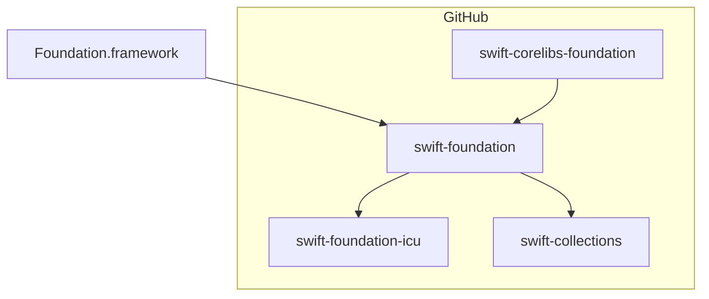

# Foundation

Foundation provides a base layer of functionality useful in many applications, including fundamental types for numbers, data, collections, and dates, as well as functions for task management, file system access, and more.

It is designed with these goals in mind:

* Provide a small set of basic utility types
* Enable a level of platform independence, to enhance portability
* Demonstrate useful conventions that can be widely adopted by the Swift ecosystem
* Support internationalization and localization to make software accessible around the world

This project, `swift-foundation`, provides a shared implementation of key Foundation API for all platforms.

On macOS, iOS, and other Apple platforms, apps should use the Foundation that comes with the operating system. The Foundation framework includes this code.

On all other Swift platforms, `swift-foundation` is available as part of the toolchain. Simply `import FoundationEssentials` or `import FoundationInternationalization` to use its API. It is also re-exported from [swift-corelibs-foundation](http://github.com/apple/swift-corelibs-foundation)'s `Foundation`, `FoundationXML`, and `FoundationNetworking` modules.

## Building and Testing

> [!NOTE]
> Building swift-foundation requires the in-development Swift 6.0 toolchain. You can download the Swift 6.0 nightly toolchain from [the Swift website](https://swift.org/install).

Before building Foundation, first ensure that you have a Swift toolchain installed. Next, check out the _Getting Started_ section of the [Foundation Build Process](Foundation_Build_Process.md#getting-started) guide for detailed steps on building and testing.

## Project Navigator

Foundation builds in different configurations and is composed of several projects.

### Swift Foundation

A shared library shipped in the Swift toolchain, written in Swift. It provides the core implementation of many key types, including `URL`, `Data`, `JSONDecoder`, `Locale`, `Calendar`, and more in the `FoundationEssentials` and `FoundationInternationalization` modules. Its source code is shared across all platforms.

_swift-foundation_ depends on a limited set of packages, primarily [swift-collections](http://github.com/apple/swift-collections) and [swift-syntax](http://github.com/apple/swift-syntax).

### Swift Corelibs Foundation

A shared library shipped in the Swift toolchain. It provides compatibility API for clients that need pre-Swift API from Foundation. It is written in Swift and C. It provides, among other types, `NSObject`, class-based data structures, `NSFormatter`, and `NSKeyedArchiver`. It re-exports the `FoundationEssentials` and `FoundationInternationalization` modules, allowing compatibility for source written before the introduction of the _swift-foundation_ project. As these implementations are distinct from those written in Objective-C, the compatibility is best-effort only.

[swift-corelibs-foundation](http://github.com/apple/swift-corelibs-foundation) builds for non-Darwin platforms only. It installs the `Foundation` umbrella module, `FoundationXML`, and `FoundationNetworking`.

### Foundation ICU

A private library for Foundation, wrapping ICU. Using a standard version of ICU provides stability in the behavior of our internationalization API, and consistency with the latest releases on Darwin platforms. It is imported from the `FoundationInternationalization` module only. Clients that do not need API that relies upon the data provided by ICU can import `FoundationEssentials` instead.

### Foundation Framework

A [framework](https://developer.apple.com/library/archive/documentation/MacOSX/Conceptual/BPFrameworks/Frameworks.html) built into macOS, iOS, and all other Darwin platforms. It is written in a combination of C, Objective-C, and Swift. The Foundation framework compiles the sources from _swift-foundation_ into its binary and provides one `Foundation` module that contains all features.

## Governance

Foundation's goal is to create the best fundamental data types and internationalization features, and make them available to Swift developers everywhere. It takes advantage of emerging features in the language as they are added, and enables library and app authors to build higher level API with confidence.

This project is part of the overall [Swift project](https://swift.org). It has a workgroup to (a) oversee [community API proposals](Evolution.md) and (b) to closely coordinate with developments in the Swift project and Apple platforms. The workgroup meets regularly to review proposals, look at emerging trends in the Swift ecosystem, and discuss how the library should evolve.

## Contributions

Foundation welcomes contributions from the community, including bug fixes, tests, documentation, and ports to new platforms.

We use the [Swift forums for discussion](https://forums.swift.org/c/related-projects/foundation/99) and [GitHub Issues](https://github.com/apple/swift-foundation/issues) for tracking bugs, feature requests, and other work.

Please see the [CONTRIBUTING](https://github.com/apple/swift-foundation/blob/main/CONTRIBUTING.md) document for more information, including the process for accepting community contributions for new API in Foundation.
